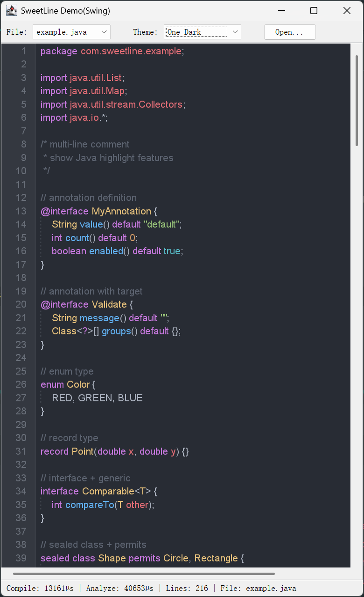
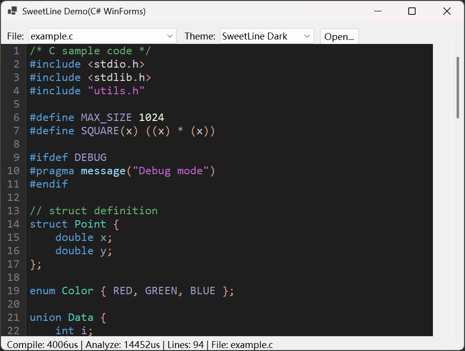
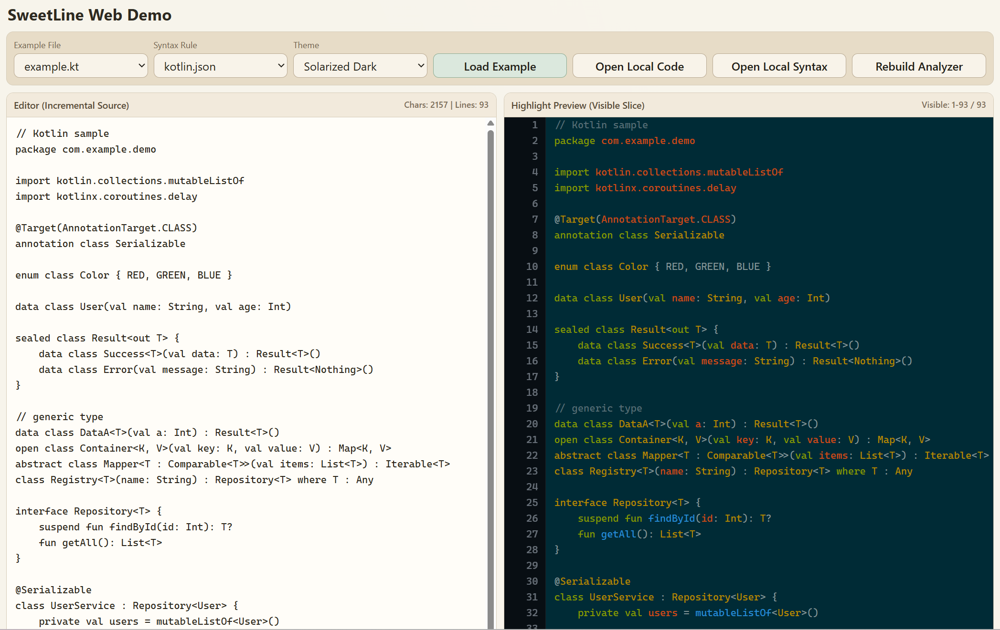
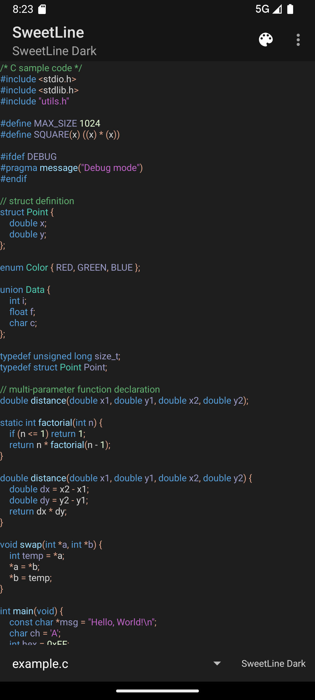

English | [简体中文](./README_zh.md)

# SweetLine Syntax Highlighting Engine

## Overview

SweetLine is a cross-platform, high-performance, and extensible syntax highlighting engine designed for modern code editors and code display scenarios. Built on the Oniguruma regex engine and a finite state machine model, it processes large code files in real-time with accurate syntax highlighting.

## Screenshots

<p align="center">
  
  
</p>
<p align="center">
  
</p>
<p align="center">
  
  
</p>

## Core Features

### High Performance
- Built on [Oniguruma](https://github.com/kkos/oniguruma) regex engine for fast pattern matching
- Incremental update algorithm that only reanalyzes changed portions, ideal for real-time editor highlighting
- Multi-line state preservation to avoid full document reanalysis
- Scope-based indent guides can be analyzed for the full document or a visible line range without running highlighting first

### High Accuracy
- Finite State Machine (FSM) based model supporting complex syntax rule nesting
- Multiple capture group style mapping for fine-grained highlighting control
- SubStates mechanism for handling nested syntax structures (e.g., generics, template parameters)
- Zero-width match support for context-sensitive state transitions

### Highly Extensible
- JSON-based syntax rule configuration – add new language support without writing code
- Variable substitution, `fragments` (`include` / `includes`), and pattern reuse to reduce rule redundancy
- `100+` built-in syntax rule files covering mainstream languages, markup, configuration, template, and domain-specific syntaxes

### Cross-Platform
- Core engine written in C++17
- C API wrapper for easy FFI integration
- Native support for Android (JNI), Java 22 (FFM), Flutter/Dart (FFI), WebAssembly (Emscripten), HarmonyOS (NAPI), .NET/WinForms (P/Invoke), and Apple platforms
- Supports Windows, Linux, macOS, mobile platforms, and other desktop scenarios

## Architecture Overview

```text
┌────────────────────────────────────────────────────────────────────────────────────┐
│                              SweetLine Architecture                               │
├────────────────────────────────────────────────────────────────────────────────────┤
│ Application / Platform Bindings                                                   │
│  Android(JNI) | Java22(FFM) | Flutter(Dart FFI) | .NET/C#(P/Invoke)              │
│  WASM(Emscripten) | HarmonyOS(NAPI) | Apple(Swift/ObjC)                           │
│  C API(FFI) | C++ Native API                                                      │
├────────────────────────────────────────────────────────────────────────────────────┤
│                         SweetLine C++ Core (C++17)                                │
│                                                                                    │
│  ┌──────────────────────┐        ┌──────────────────────────────┐                 │
│  │    HighlightEngine   │ -----> │  SyntaxRule Compiler (JSON)  │                 │
│  └──────────┬───────────┘        └──────────────────────────────┘                 │
│             │                                                                      │
│    ┌────────▼─────────┐       ┌──────────────────────┐                            │
│    │   TextAnalyzer   │       │   DocumentAnalyzer   │                            │
│    │   (Full Scan)    │       │   (Incremental)      │                            │
│    └────────┬─────────┘       └──────────┬───────────┘                            │
│             │                            │                                         │
│             │                   ┌────────▼─────────┐                               │
│             │                   │  Document Model  │                               │
│             │                   │ (Managed Text)   │                               │
│             │                   └──────────────────┘                               │
│             │                                                                      │
│             └──────────────┬───────────────────────┘                               │
│                            ▼                                                       │
│          ┌────────────────────────────────────────────────────────────┐            │
│          │ Regex + FSM Runtime (Oniguruma + State Machine)           │            │
│          └──────────────────────────┬─────────────────────────────────┘            │
│                                     ▼                                              │
│              Highlight Result + Scope/Indent Guide Analysis                        │
└────────────────────────────────────────────────────────────────────────────────────┘
```

## Quick Start

### C++ Usage

```cpp
#include "highlight.h"
using namespace sweetline;

// 1. Create highlight engine
auto engine = std::make_shared<HighlightEngine>();

// 2. Compile syntax rules
auto rule = engine->compileSyntaxFromFile("syntaxes/java.json");

// 3. Create document object
auto document = std::make_shared<Document>("example.java", R"(
public class HelloWorld {
    public static void main(String[] args) {
        System.out.println("Hello, World!");
    }
}
)");

// 4. Load document and analyze
auto analyzer = engine->loadDocument(document);
auto highlight = analyzer->analyze();

// 5. Iterate highlight results
for (size_t i = 0; i < highlight->lines.size(); i++) {
    auto& line = highlight->lines[i];
    for (auto& span : line.spans) {
        // span.range  - text range (line/column/index)
        // span.style_id - style ID (keyword=1, string=2, ...)
    }
}
```

### Incremental Updates

```cpp
// When the document is edited, only reanalyze the changed portion
TextRange change_range { {2, 4}, {2, 8} };
std::string new_text = "modified";
auto new_highlight = analyzer->analyzeIncremental(change_range, new_text);

LineRange visible_range {100, 60};

// Analyze enough lines to cover the requested visible range
auto analyzed_slice = analyzer->analyzeLineRange(visible_range);

// Read only the visible lines from the latest cached highlight result
auto cached_slice = analyzer->getHighlightSlice(visible_range);

// Or combine patch + visible slice in one call
auto updated_slice = analyzer->analyzeIncrementalInLineRange(change_range, new_text, visible_range);

// Indent guides are independent from highlighting and can be sliced to the viewport
auto visible_guides = analyzer->analyzeIndentGuidesInLineRange(visible_range);
```

Use `analyzeLineRange()` when the renderer needs a visible slice and wants SweetLine to analyze enough lines from the current document state first.
Use `getHighlightSlice()` after `analyze()` or `analyzeIncremental()` when the renderer only needs a visible window of lines.

### Java 22 (FFM) Usage

```java
import com.qiplat.sweetline.*;

try (HighlightEngine engine = new HighlightEngine(new HighlightConfig(true, false))) {
    engine.compileSyntaxFromFile("syntaxes/java.json");

    try (TextAnalyzer analyzer = engine.createAnalyzerByFileName("Example.java")) {
        DocumentHighlight result = analyzer.analyzeText(sourceCode);
    }
}
```

Java 22 FFM wrapper is located at `platform/Java22`.
Running code requires native access enabled (for example `--enable-native-access=ALL-UNNAMED`) and a resolvable SweetLine native library path.

### Android Usage

```groovy
// build.gradle
implementation 'com.qiplat:sweetline:1.2.4'
```

```java
// Create engine
HighlightEngine engine = new HighlightEngine(new HighlightConfig());

// Compile syntax rules
engine.compileSyntaxFromJson(jsonString);

// Full analysis
TextAnalyzer analyzer = engine.createAnalyzerByFileName("MainActivity.java");
DocumentHighlight result = analyzer.analyzeText(sourceCode);

// Iterate results
for (LineHighlight line : result.lines) {
    for (TokenSpan span : line.spans) {
        // span.range, span.styleId
    }
}
```

### WebAssembly Usage

```javascript
import createSweetLine from './sweetline.js';

const sl = await createSweetLine();
const config = new sl.HighlightConfig();
const engine = new sl.HighlightEngine(config);

// Compile syntax rules
engine.compileSyntaxFromJson(jsonString);

// Analyze text
const analyzer = engine.createAnalyzerByFileName("main.js");
const highlight = analyzer.analyzeText(sourceCode);

// Iterate results
for (let i = 0; i < highlight.lines.size(); i++) {
    const line = highlight.lines.get(i);
    for (let j = 0; j < line.spans.size(); j++) {
        const span = line.spans.get(j);
        // span.range, span.styleId
    }
}
```

### Custom Syntax Rules

SweetLine uses JSON to define syntax rules. Here is a simple example:

Routing metadata is file-name based. Use `fileName` / `fileNames` for exact base names, `fileSuffix` / `fileSuffixes` for suffix matches, and `fileNamePattern` / `fileNamePatterns` only when exact names and suffixes are not enough.

```json
{
  "name": "myLanguage",
  "fileSuffixes": [".mylang"],
  "variables": {
    "identifier": "[a-zA-Z_]\\w*"
  },
  "fragments": {
    "commonLiterals": [
      { "pattern": "\"(?:[^\"\\\\]|\\\\.)*\"", "style": "string" },
      { "pattern": "//[^\\n]*", "style": "comment" }
    ]
  },
  "states": {
    "default": [
      {
        "pattern": "\\b(if|else|while|return)\\b",
        "styles": [1, "keyword"]
      },
      { "include": "commonLiterals" }
    ]
  }
}
```

For complete syntax rule configuration, see the [Syntax Rule Configuration Guide](docs/en/syntax_rule.md).

If you want to add or refine syntax rules more quickly, you can also use the skill in [`skills/`](skills). The recommended entry is:
- [`sweetline-syntax-profile`](skills/sweetline-syntax-profile/SKILL.md): the SweetLine syntax-authoring workflow and repository policy for syntax rules, routing, style vocabulary, examples, tests, and demo registration

## Documentation

| Document | Description |
|----------|-------------|
| [Syntax Rule Configuration Guide](docs/en/syntax_rule.md) | Detailed guide on writing JSON syntax rule files |
| [Engine Comparison Report](docs/en/engine_comparison.md) | Multidimensional comparison with mainstream syntax highlighting engines |
| [API Reference (Index)](docs/en/api.md) | API entry page and reading order |
| [Core API](docs/en/api_core.md) | Core concepts and C++ API |
| [C API](docs/en/api_c.md) | C interface for FFI integration |
| [macOS Swift API](docs/en/api_macos.md) | Swift Package API on macOS |
| [iOS Swift API](docs/en/api_ios.md) | Swift Package API on iOS |
| [Android API](docs/en/api_android.md) | Java/Kotlin API on Android |
| [Flutter API](docs/en/api_flutter.md) | Dart FFI wrapper API |
| [Java 22 API](docs/en/api_java22.md) | Java 22 FFM API |
| [.NET / WinForms API](docs/en/api_dotnet.md) | C# API (P/Invoke wrapper) |
| [WebAssembly API](docs/en/api_wasm.md) | JavaScript/TypeScript API |
| [HarmonyOS API](docs/en/api_ohos.md) | ArkTS/NAPI API usage |
| [Build Guide](docs/en/api_build.md) | Multi-platform build commands and options |
| [Contributing Guide](docs/en/join.md) | How to participate in the project, including using repository skills for faster syntax authoring |

## Grammar Pack

SweetLine provides a grammar pack covering `100+` language and syntax scenarios, including mainstream programming languages, markup languages, configuration formats, template syntaxes, and specialized grammars.

Both the grammars shipped with the repository and developer-authored custom grammars are compiled through `HighlightEngine` before use, making it easy to adapt SweetLine to different languages, frameworks, and domain-specific scenarios.

See the `syntaxes/` directory for the available grammar set, and the [Syntax Rule Configuration Guide](docs/en/syntax_rule.md) for authoring details.

## Performance Tips

- **Pre-compile syntax rules**: Compile all required syntax rules at application startup; compiled rules are reusable
- **Prefer incremental updates**: For editor scenarios, use `DocumentAnalyzer` incremental analysis instead of full analysis
- **Optimize regular expressions**: Avoid overly complex backtracking-intensive patterns; use `variables` to reuse common patterns
- **Design state machines carefully**: Control the number of states and ensure every state has a clear exit path

## Contributing

We welcome contributions to the SweetLine highlighting engine! If you'd like to participate, feel free to fork the repository, make changes, and submit merge requests. For syntax-related work, we recommend using the skills in [`skills/`](skills) together with the [Contributing Guide](docs/en/join.md).
