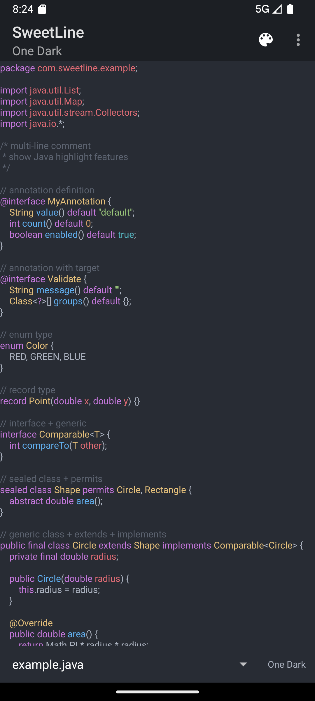
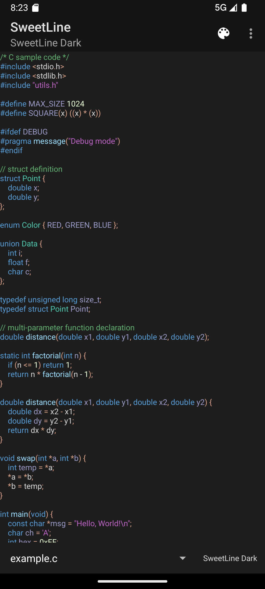
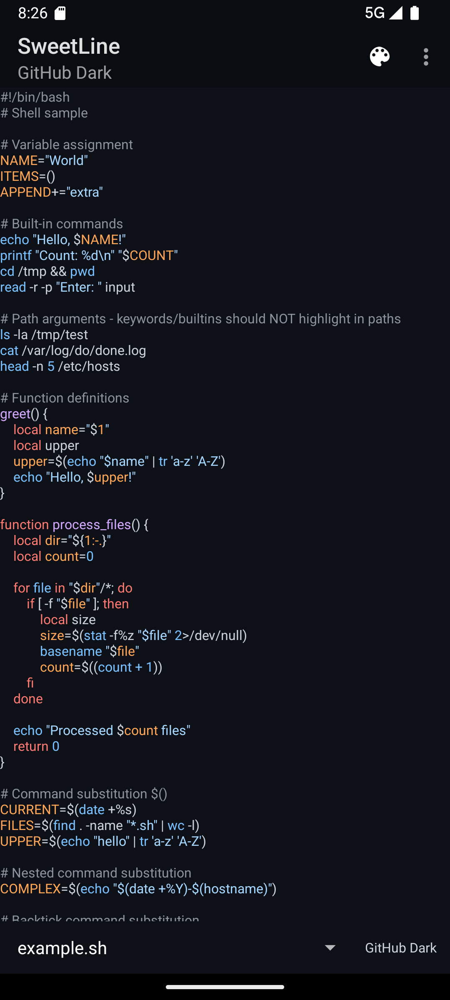
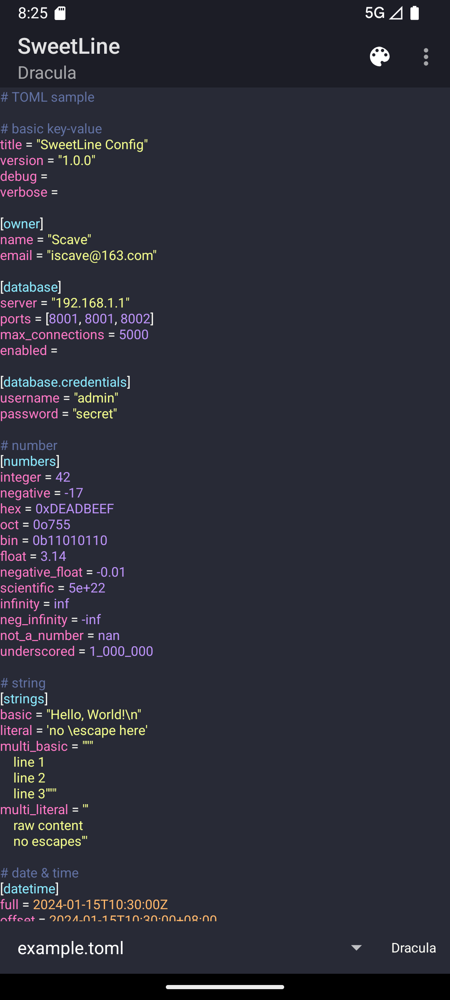

English | [简体中文](./README.md)

# SweetLine Syntax Highlighting Engine

## Overview

SweetLine is a cross-platform, high-performance, and extensible syntax highlighting engine designed for modern code editors and code display scenarios. Built on the Oniguruma regex engine and a finite state machine model, it processes large code files in real-time with accurate syntax highlighting.

## Screenshots

<p align="center">
  
  
</p>
<p align="center">
  
  
</p>

## Core Features

### High Performance
- Built on [Oniguruma](https://github.com/kkos/oniguruma) regex engine for fast pattern matching
- Incremental update algorithm that only reanalyzes changed portions, ideal for real-time editor highlighting
- Multi-line state preservation to avoid full document reanalysis

### High Accuracy
- Finite State Machine (FSM) based model supporting complex syntax rule nesting
- Multiple capture group style mapping for fine-grained highlighting control
- SubStates mechanism for handling nested syntax structures (e.g., generics, template parameters)
- Zero-width match support for context-sensitive state transitions

### Highly Extensible
- JSON-based syntax rule configuration — add new language support without writing code
- Variable substitution and pattern reuse to reduce rule redundancy
- 25+ built-in language syntax rules (Java, C/C++, Python, Kotlin, Rust, Go, TypeScript, etc.)

### Cross-Platform
- Core engine written in C++17
- C API wrapper for easy FFI integration
- Native support for Android (JNI), WebAssembly (Emscripten), HarmonyOS (NAPI)
- Supports Windows, Linux, macOS and other desktop platforms

## Architecture Overview

```
┌─────────────────────────────────────────────────────────┐
│                    Application Layer                     │
├──────────┬──────────┬──────────┬────────────┬───────────┤
│ Android  │   WASM   │   OHOS   │   C API    │   C++     │
│  (JNI)   │(Emscript)│  (NAPI)  │  (FFI)     │  (Native) │
├──────────┴──────────┴──────────┴────────────┴───────────┤
│                 SweetLine Core (C++17)                   │
│  ┌─────────────┐ ┌──────────────┐ ┌──────────────────┐  │
│  │HighlightEng │ │ TextAnalyzer │ │DocumentAnalyzer  │  │
│  │    ine      │ │ (Full Scan)  │ │(Incremental)     │  │
│  └──────┬──────┘ └──────┬───────┘ └────────┬─────────┘  │
│         │               │                  │             │
│  ┌──────▼───────────────▼──────────────────▼─────────┐  │
│  │           State Machine + Regex Engine             │  │
│  │              (Oniguruma + FSM)                     │  │
│  └───────────────────────────────────────────────────┘  │
│  ┌───────────────────────────────────────────────────┐  │
│  │           SyntaxRule (JSON Compiled)               │  │
│  └───────────────────────────────────────────────────┘  │
└─────────────────────────────────────────────────────────┘
```

## Quick Start

### C++ Usage

```cpp
#include "highlight.h"
using namespace sweetline;

// 1. Create highlight engine
auto engine = std::make_shared<HighlightEngine>();

// 2. Compile syntax rules
auto rule = engine->compileSyntaxFromFile("syntaxes/java.json");

// 3. Create document object
auto document = std::make_shared<Document>("file:///example.java", R"(
public class HelloWorld {
    public static void main(String[] args) {
        System.out.println("Hello, World!");
    }
}
)");

// 4. Load document and analyze
auto analyzer = engine->loadDocument(document);
auto highlight = analyzer->analyze();

// 5. Iterate highlight results
for (size_t i = 0; i < highlight->lines.size(); i++) {
    auto& line = highlight->lines[i];
    for (auto& span : line.spans) {
        // span.range  - text range (line/column/index)
        // span.style_id - style ID (keyword=1, string=2, ...)
    }
}
```

### Incremental Updates

```cpp
// When the document is edited, only reanalyze the changed portion
TextRange change_range { {2, 4}, {2, 8} };
std::string new_text = "modified";
auto new_highlight = analyzer->analyzeIncremental(change_range, new_text);
```

### Android Usage

```groovy
// build.gradle
implementation 'com.qiplat:sweetline:0.0.4'
```

```java
// Create engine
HighlightEngine engine = new HighlightEngine(new HighlightConfig());

// Compile syntax rules
engine.compileSyntaxFromJson(jsonString);

// Full analysis
TextAnalyzer analyzer = engine.createAnalyzerByName("java");
DocumentHighlight result = analyzer.analyzeText(sourceCode);

// Iterate results
for (LineHighlight line : result.lines) {
    for (TokenSpan span : line.spans) {
        // span.range, span.styleId
    }
}
```

### WebAssembly Usage

```javascript
import { sweetline } from './libsweetline.js';

// Create engine
const config = new sweetline.HighlightConfig();
const engine = new sweetline.HighlightEngine(config);

// Compile syntax rules
engine.compileSyntaxFromJson(jsonString);

// Analyze text
const analyzer = engine.createAnalyzerByName("javascript");
const highlight = analyzer.analyzeText(sourceCode);

// Iterate results
for (let i = 0; i < highlight.lines.size(); i++) {
    const line = highlight.lines.get(i);
    for (let j = 0; j < line.spans.size(); j++) {
        const span = line.spans.get(j);
        // span.range, span.styleId
    }
}
```

### Custom Syntax Rules

SweetLine uses JSON to define syntax rules. Here is a simple example:

```json
{
  "name": "myLanguage",
  "fileExtensions": [".mylang"],
  "variables": {
    "identifier": "[a-zA-Z_]\\w*"
  },
  "states": {
    "default": [
      {
        "pattern": "\\b(if|else|while|return)\\b",
        "styles": [1, "keyword"]
      },
      {
        "pattern": "\"(?:[^\"\\\\]|\\\\.)*\"",
        "style": "string"
      },
      {
        "pattern": "//[^\\n]*",
        "style": "comment"
      }
    ]
  }
}
```

For complete syntax rule configuration, see the [Syntax Rule Configuration Guide](docs/syntax_rule_en.md).

## Documentation

| Document | Description |
|----------|-------------|
| [Syntax Rule Configuration Guide](docs/syntax_rule_en.md) | Detailed guide on writing JSON syntax rule files |
| [API Reference](docs/api_en.md) | API usage for C++, C, Android, and WebAssembly |
| [Contributing Guide](docs/join_en.md) | How to participate in the project |

## Built-in Language Support

| Language | File | Language | File |
|----------|------|----------|------|
| Java | `java.json` | Python | `python.json` |
| C | `c.json` | C++ | `c++.json` |
| C# | `csharp.json` | Kotlin | `kotlin.json` |
| Swift | `swift.json` | Rust | `rust.json` |
| Go | `go.json` | Dart | `dart.json` |
| TypeScript | `typescript.json` | JavaScript | `javascript.json` |
| HTML | `html.json` | XML | `xml.json` |
| SQL | `sql.json` | Shell | `shell.json` |
| Lua | `lua.json` | Groovy | `groovy.json` |
| YAML | `yaml.json` | TOML | `toml.json` |
| Markdown | `markdown.json` | JSON | `json-sweetline.json` |

## Performance Tips

- **Pre-compile syntax rules**: Compile all required syntax rules at application startup; compiled rules are reusable
- **Prefer incremental updates**: For editor scenarios, use `DocumentAnalyzer` incremental analysis instead of full analysis
- **Optimize regular expressions**: Avoid overly complex backtracking-intensive patterns; use `variables` to reuse common patterns
- **Design state machines carefully**: Control the number of states and ensure every state has a clear exit path

## Contributing

We welcome contributions to the SweetLine highlighting engine! If you'd like to participate, feel free to fork the repository, make changes, and submit merge requests. See the [Contributing Guide](docs/join_en.md) for details.
